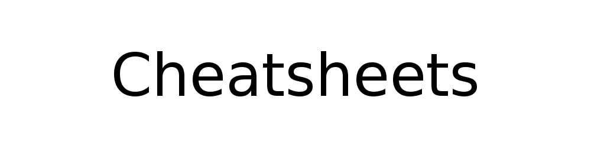

	

# Overview

Collection of cheatsheets I regularly use. Most of them are in Serbian language. 

## Contents

**Computer science and programming**

- [AWK](cs/awk/)
- [Bash](cs/bash/)
- [Computer science 101 - Binary numbers](cs/compsci/binary_numbers.md)
- [Computer science 101 - Computer networks](cs/compsci/computer_networks/)
- [Computer science 101 - Cryptology](cs/compsci/cryptology/)
- [Computer science 101 - Operating systems](cs/compsci/operating_systems/)
- [Computer science 101 - Web application development](cs/compsci/web_application_development.md)
- [Cron](cs/crontab.md)
- [cURL](cs/curl.md)
- [Docker](cs/docker/)
- [Git (ENG)](cs/git.md)
- [Linux networking](cs/linux_networking.md)
- [MySQL](cs/mysql/)
- [OpenSSL](cs/openssl/)
- [*Web Scraping with Python*](cs/web_scraping_with_python.md)

**Mixed**

- [Bookmarks](cs/misc/bookmarks.md)
- [Payment cards](cs/misc/payment_cards.md)
- [Unit prefixes](cs/misc/unit_prefixes.md)
