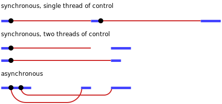

# Asynchronous programming

**Asynchronous programming**

- The central part of a computer, the part that carries out the individual steps that make up our programs, is called the *processor*
- The programs we have seen so far are things that will keep the processor busy until they have finished their work
- The speed at which something like a loop that manipulates numbers can be executed depends pretty much entirely on the speed of the processor
- But many programs interact with things outside of the processor, for example, they may communicate over a computer network or request data from the hard disk, which is a lot slower than getting it from memory
- When such a thing is happening, it would be a shame to let the processor sit idle, there might be some other work it could do in the meantime

**Asynchronicity**

- In a *synchronous* programming model, things happen one at a time - when you call a function that performs a long-running action, it returns only when the action has finished and it can return the result
- This stops your program for the time the action takes
- An *asynchronous* model allows multiple things to happen at the same time
	- When you start an action, your program continues to run
	- When the action finishes, the program is informed and gets access to the result (for example, the data read from disk)
- We can compare synchronous and asynchronous programming using a small example: a program that fetches two resources from the network and then combines results
- In a synchronous environment, where the request function returns only after it has done its work, the easiest way to perform this task is to make the requests one after the other; this has the drawback that the second request will be started only when the first has finished - the total time taken will be at least the sum of the two response times
- The solution to this problem, in a synchronous system, is to start additional threads of control
- A *thread* is another running program whose execution may be interleaved with other programs by the operating system; since most modern computers contain multiple processors, multiple threads may even run at the same time, on different processors
- A second thread could start the second request, and then both threads wait for their results to come back, after which they resynchronize to combine their results
- In the synchronous model, the time taken by the network is *part* of the timeline for a given thread of control
- In the asynchronous model, starting a network action conceptually causes a *split* in the timeline
- The program that initiated the action continues running, and the action happens alongside it, notifying the program when it is finished
- In the following diagram, the thick lines represent time the program spends running normally, and the thin lines represent time spent waiting for the network



- Another way to describe the difference is that waiting for actions to finish is *implicit* in the synchronous model, while it is *explicit*, under our control, in the asynchronous one
- Asynchronicity cuts both ways - it makes expressing programs that do not fit the straight-line model of control easier, but it can also make expressing programs that do follow a straight line more awkward
- Both of the important JS programming platforms (browsers and Node.js) make operations that might take a while asynchronous, rather than relying on threads - since programming with threads is notoriously hard, this is generally considered a good thing

**Callbacks**

- One approach to asynchronous programming is to make functions that perform a slow action take an extra argument, a *callback function*
- The action is started, and when it finishes, the callback function is called with the result
- As an example, the `setTimeout` function (available both in Node.js and in browsers) waits a given number of milliseconds and then calls a function:

```
setTimeout(() => console.log("Tick."), 500);
```

- Waiting is not generally a very important type of work, but it can be useful when doing something like updating an animation or checking whether something is taking longer than a given amount of time
- Performing multiple asynchronous actions in a row using callbacks means that you have to keep passing new functions to handle the continuation of the computation after the actions
- This style of programming is workable, but the indentation level increases with each asynchronous action because you end up in another function

```
function callback() {
	console.log("Tick.");
}

setTimeout(() => {
	setTimeout(() => {
		setTimeout(callback, 500);
	}, 500);
}, 500);
```

- A function doing asynchronous work typically returns before the work is done, having arranged for a callback to be called when it completes
- So we need some asynchronous mechanism, in this case, another callback function, to signal when a response is available
- In a way, asynchronicity is *contagious*, any function that calls a function that works asynchronously must itself be asynchronous, using a callback or similar mechanism to deliver its result
- Calling a callback is somewhat more involved and error-prone than simply returning a value, so needing to structure large parts of your program that way is not great

**Promises**

- Working with abstract concepts is often easier when those concepts can be represented by values
- In the case of asynchronous actions, you could, instead of arranging for a function to be called at some point in the future, return an object that represents this future event
- This is what the standard class `Promise` is for
- A *promise* is an asynchronous action that may complete at some point and produce a value and it is able to notify anyone who is interested when its value is available
- The easiest way to create a promise is by calling `Promise.resolve`
- This function ensures that the value you give it is wrapped in a promise
- If it's already a promise, it is simply returned, otherwise, you get a new promise that immediately finishes with your value as its result:

```
let fifteen = Promise.resolve(15);
fifteen.then(value => console.log(`Got ${value}.`)); // Got 15.
```

- To get the result of a promise, you can use its `then` method
- This registers a callback function to be called when the promise resolves and produces a value
- You can add multiple callbacks to a single promise, and they will be called, even if you add them after the promise has already *resolved* (finished)
- But that's not all the `then` method does - it returns another promise, which resolves to the value that the handler function returns or, if that returns a promise, waits for that promise and then resolves to its result
- It is useful to think of promises as a device to move values into an asynchronous reality - a normal value is simply there, but a promised value is a value that *might* already be there or might appear at some point in the future
- Computations defined in terms of promises act on such wrapped values and are executed asynchronously as the values become available
- To create a promise, you can use `Promise` as a constructor
- The constructor expects a function as argument, which it immediately calls, passing it a function that it can use to resolve the promise
- It works this way, instead of for example with a `resolve` method, so that only the code that created the promise can resolve it

```
function sayHello(name) {
	return new Promise(resolve => resolve(`${name} said: "Hello!"`));
}

sayHello("John")
	.then(value => console.log(value)); // John said: "Hello!"
```

- This asynchronous function returns a meaningful value, and this is the main advantage of promises - they simplify the use of asynchronous functions
- Instead of having to pass around callbacks, promise-based functions look similar to regular ones: they take input as arguments and return their output, the only difference is that the output may not be available yet

**Failure**

- Regular JS computations can fail by throwing an exception
- Asynchronous computations often need something like that - a network request may fail, or some code that is part of the asynchronous computation may throw an exception
- One of the most pressing problems with the callback style of asynchronous programming is that it makes it extremely difficult to make sure failures are properly reported to the callbacks
- A widely used convention is that the first argument to the callback is used to indicate that the action failed, and the second contains the value produced by the action when it was successful
- Such callback functions must always check whether they received an exception and make sure that any problems they cause, including exceptions thrown by functions they call, are caught and given to the right function
- Promises make this easier - they can be either resolved (the action finished successfully) or rejected (it failed)
- Resolve handlers (as registered with `then`) are called only when the action is successful, and rejections are automatically propagated to the new promise that is returned by `then`, and when a handler throws an exception, this automatically causes the promise produced by its `then` call to be rejected
- So if any element in a chain of asynchronous actions fails, the outcome of the whole chain is marked as rejected, and no success handlers are called beyond the point where it failed
- Much like resolving a promise provides a value, rejecting one also provides one, usually called the *reason* of the rejection
- When an exception in a handler function causes the rejection, the exception value is used as the reason
- Similarly, when a handler returns a promise that is rejected, that rejection flows into the next promise
- There's a `Promise.reject` function that creates a new, immediately rejected promise
- To explicitly handle such rejections, promises have a `catch` method that registers a handler to be called when the promise is rejected, similar to how `then` handlers handle normal resolution
- It's also very much like `then` in that it returns a new promise, which resolves to the original promise's value if it resolves normally and to the result of the `catch` handler otherwise
- If a `catch` handler throws an error, the new promise is also rejected
- As a shorthand, `then` also accepts a rejection handler as a second argument, so you can install both types of handlers in a single method call
- A function passed to the `Promise` constructor receives a second argument, alongside the resolve function, which it can use to reject the new promise:

```
function sayHello(name) {
	return new Promise((resolve, reject) => {
		if (name) {
			resolve(`${name} said: "Hello!"`);
		} else {
			reject("Error!");
		}
	});
}

sayHello("")
	.then(value => console.log(value))
	.catch(reason => console.log(reason)); // Error!
```

- The chains of promise values created by calls to `then` and `catch` can be seen as a pipeline through which asynchronous values or failures move
- Since such chains are created by registering handlers, each link has a success handler or a rejection handler (or both) associated with it
- Handlers that don't match the type of outcome (success or failure) are ignored
- But those that do match are called, and their outcome determines what kind of value comes next - success when it returns a non-promise value, rejection when it throws an exception, and the outcome of a promise when it returns one of those

```
new Promise((_, reject) => reject(new Error("Fail.")))
	.then(value => console.log("Handler #1: " + value))
	.catch(reason => {
		console.log("Failure: " + reason);
		return "/";
	})
	.then(value => console.log("Handler #2: " + value));
// Failure: Error: Fail.
// Handler #2: /
```

- Much like an uncaught exception is handled by the environment, JS environments can detect when a promise rejection isn't handled and will report this as an error

**Collections of promises**

- When working with collections of promises running at the same time, the `Promise.all` function can be useful:

```
let promises = ["John", "Peter", ""].map(name => {
	return sayHello(name).then(() => true).catch(() => false);
});
console.log(promises); // [Promise, Promise, Promise]

Promise.all(promises).then(values => console.log(values)); // [true, true, false]
```

- It returns a promise that waits for all of the promises in the array to resolve and then resolves to an array of the values that these promises produced (in the same order as the original array)
- If any promise is rejected, the result of `Promise.all` is itself rejected

**Async functions**

- JS allows you to write pseudo-synchronous code to describe asynchronous computation
- An `async` function is a function that implicitly returns a promise and that can, in its body, `await` other promises in a way that *looks* synchronous

```
function sayHello(name) {
	return new Promise((resolve, reject) => {
		if (name) {
			resolve(`${name} said: "Hello!"`);
		} else {
			reject("Error!");
		}
	});
}

async function run() {
	try {
		const p1 = await sayHello("John");
		console.log(p1); // John said: "Hello!"
		const p2 = await sayHello("");
		console.log(p2);
	} catch (reason) {
		console.log("Failure: " + reason); // Failure: Error!
	}
}

run();
```

- An `async` function is marked by the word `async` before the `function` keyword
- Methods can also be made `async` by writing `async` before their name
- When such a function or method is called, it returns a promise
- As soon as the body returns something, that promise is resolved, and if it throws an exception, the promise is rejected
- Inside an `async` function, the word `await` can be put in front of an expression to wait for a promise to resolve and only then continue the execution of the function
- Such a function no longer, like a regular JS function, runs from start to completion in one go - instead, it can be *frozen* at any point that has an `await` and can be resumed at a later time
- For non-trivial asynchronous code, this notation is usually more convenient than directly using promises

**Generators**

- This ability of functions to be paused and then resumed again is not exclusive to `async` functions
- JS also has a feature called *generator* functions - these are similar, but without the promises
- When you define a function with `function*` (placing an asterisk after the word `function`), it becomes a generator
- When you call a generator, it returns an iterator

```
function* powers(n) {
	for (let current = n; ; current *= n) {
		if (current > 50) return;
		yield current;
	}
}

for (let power of powers(3)) {
	console.log(power);
}

// 3
// 9
// 27
```

- Initially, when you call `powers`, the function is frozen at its start
- Every time you call `next` on the iterator, the function runs until it hits a `yield` expression, which pauses it and causes the yielded value to become the next value produced by the iterator
- When the function returns, the iterator is done
- Writing iterators is often much easier when you use generator functions
- There's no longer a need to create an object to hold the iteration state - generators automatically save their local state every time they yield
- Such `yield` expressions may occur only directly in the generator function itself and not in an inner function you define inside of it
- An `async` function is a special type of generator
- It produces a promise when called, which is resolved when it returns (finishes) and rejected when it throws an exception
- Whenever it yields (awaits) a promise, the result of that promise (value or thrown exception) is the result of the `await` expression

**The event loop**

- Asynchronous programs are executed piece by piece
- Each piece may start some actions and schedule code to be executed when the action finishes or fails
- In between these pieces, the program sits idle, waiting for the next action
- So callbacks are not directly called by the code that scheduled them
- If I call `setTimeout` from within a function, that function will have returned by the time the callback function is called
- And when the callback returns, control does not go back to the function that scheduled it
- Asynchronous behavior happens on its own empty function call stack
- This is one of the reasons that, without promises, managing exceptions across asynchronous code is hard
- Since each callback starts with a mostly empty stack, your `catch` handlers won't be on the stack when they throw an exception:

```
try {
	setTimeout(() => {
		throw new Error("Woosh.");
	}, 10);
} catch (_) {
	// This will not run
	console.log("Caught!");
}
```

- No matter how closely together events (such as timeouts or incoming requests) happen, a JS environment will run only one program at a time
- You can think of this as it running a big loop *around* your program, called the *event loop*
- When there's nothing to be done, that loop is stopped
- But as events come in, they are added to a queue, and their code is executed one after the other
- Because no two things run at the same time, slow-running code might delay the handling of other events
- Promises always resolve or reject as a new event
- Even if a promise is already resolved, waiting for it will cause your callback to run after the current script finishes, rather than right away:

```
Promise.resolve("Done").then(console.log);
console.log("Me first!");
// Me first!
// Done
```

**Asynchronous bugs**

- When your program runs synchronously, in a single go, there are no state changes happening except those that the program itself makes
- For asynchronous programs this is different - they may have *gaps* in their execution during which other code can run
- An advantage of JS's explicit asynchronicity (whether through callbacks, promises, or `await`) is that spotting these gaps is relatively easy
