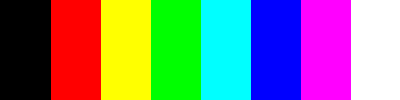

# Модели боја

**CSS најчешће користи два модела боја:**

- RGB
- HSL

## RGB

- енгл. *Red, green, blue*
- Црвена, зелена и плава
- Боја у RGB моделу представља збир три вредности (црвене, зелене и плаве)
- Бројеви могу имати вредност између 0 и 255
- нпр. `rgb(0, 128, 255)`
- RGB је адитивни модел боја (вредности се сабирају)
	- Што је нека од ове три вредности већа, то је боја светлија
	- Ако су све три вредности 0, резултат је црна боја
	- Ако су све три вредности 255, резултат је бела боја
	- Ако су све три вредности исте, резултат је сива боја
- нпр.:
	- Црна: `rgb(0, 0, 0)`
	- Црвена: `rgb(255, 0, 0)`
	- Жута: `rgb(255, 255, 0)`
	- Зелена: `rgb(0, 255, 0)`
	- Цијан: `rgb(0, 255, 255)`
	- Плава: `rgb(0, 0, 255)`
	- Магента: `rgb(255, 0, 255)`
	- Бела: `rgb(255, 255, 255)`
- Боје се могу приказати и хексадецималном нотацијом:
	- `rgb(0, 0, 0)` = `#000000`
	- `rgb(0, 128, 255)` = `#0080ff` 
	- `rgb(255, 255, 255)` = `#ffffff`

### CMYK

- енгл. *Cyan, magenta, yellow, key (black)*
- Цијан, магента, жута и црна
- RGB модел је бољи за дигиталну, а CMYK за штампану употребу
- CMYK је субтрактивни модел боја
	- Када од беле боје одузмемо црвену добијамо цијан
	- Када од беле боје одузмемо зелену добијамо магенту
	- Када од беле боје одузмемо плаву добијамо жуту
- Ако су све вредности 0%, резултат је бела боја
- Црна боја: прве три вредности (C, M, Y) су 100% **или** последња вредност (K) је 100%
- нпр.:
	- Бела: `cmyk(0%, 0%, 0%, 0%)`
	- Црвена: `cmyk(0%, 100%, 100%, 0%)`
	- Жута: `cmyk(0%, 0%, 100%, 0%)`
	- Зелена: `cmyk(100%, 0, 100%, 0%)`
	- Цијан: `cmyk(100%, 0%, 0%, 0%)`
	- Плава: `cmyk(100%, 100%, 0%, 0%)`
	- Магента: `cmyk(0%, 100%, 0%, 0%)`

## HSL

- енгл. *Hue, saturation, lightness*
- Нијанса, сатурација, светлост
- Нијанса - изражава се у степенима (0deg - 360deg)
- Сатурација - изражава се у процентима и одређује интензитет боје
- Светлост - изражава се у процентима и одређује колико је светла боја
	- Нормално: 50%
	- Бела: 100%
	- Црна: 0%
- нпр.:
	- Црвена: `hsl(0deg, 100%, 50%)`
	- Жута: `hsl(60deg, 100%, 50%)`
	- Зелена: `hsl(120deg, 100%, 50%)`
	- Цијан: `hsl(180deg, 100%, 50%)`
	- Плава: `hsl(240deg, 100%, 50%)`
	- Магента: `hsl(300deg, 100%, 50%)`
