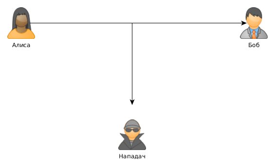
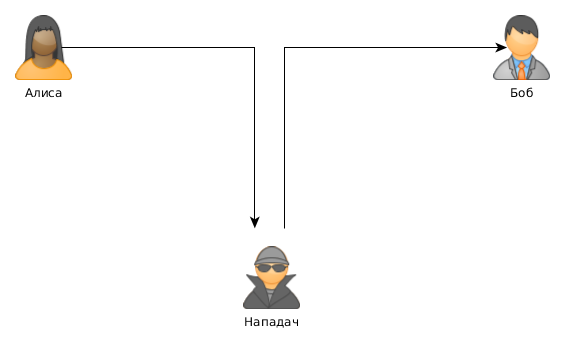
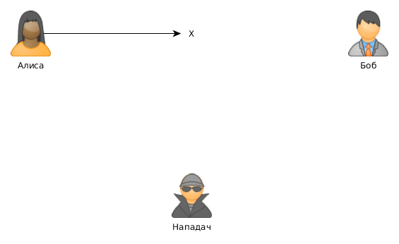
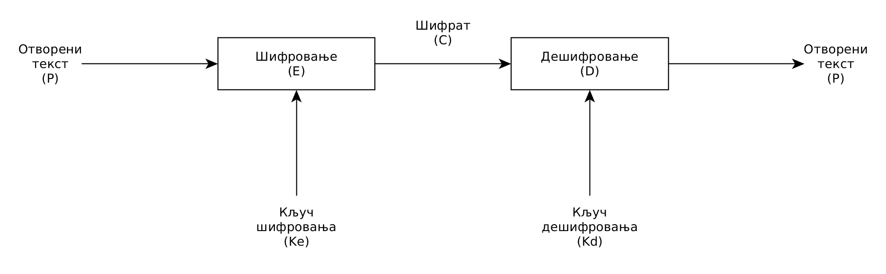

# Криптологија - увод

**Порекло речи**

- стгрч. *kryptòs* - скривено, тајно
- стгрч. *graphein* - писати
- стгрч. *logia* - наука

**Основни безбедносни концепти - CIA тројство**

- Поверљивост (енгл. *Confidentiality*)
- Веродостојност (енгл. *Integrity*)
- Доступност (енгл. *Availability*)

**Циљ сервиса заштите поверљивости**

- Обезбедити да неовлашћена страна не дође до поверљивих информација
- Дефинише до које мере нека информација треба да буде доступна, односно недоступна неовлашћеним странама

	

**Циљ сервиса заштите веродостојности (интегритета)**

- Превенција неовлашћене промене садржаја
- Може бити нарушена у случају напада:
	- Неовлашћене стране
	- Овлашћене стране која злоупотребљава своје привилегије

	

**Циљ сервиса заштите доступности**

- Одржати способност система да пружи услугу овлашћеној страни
- Напади типа DoS (енгл. *Denial of Service*)

	

**Основни безбедносни концепти могу бити оријентисани на:**

- Превенцију - примена механизама који ће унапред да остваре жељене захтеве
- Детекцију - брзо откривање и корекција пропуста

**Основни појмови**

- Отворени текст
	- енгл. *plain text*
	- Порука која треба да се заштити
- Шифровање
	- енгл. *encryption*
	- Операција којом се отворени текст мења како би постао неразумљив
- Шифрат
	- енгл. *ciphertext*
	- Резултат шифровања
- Дешифровање
	- енгл. *decryption*
	- Операција којом се из шифрата добија отворени текст
- Алгоритам шифровања/дешифровања
	- енгл. *algorithm*
	- Скуп правила који се користи за шифровање/дешифровање
- Кључ шифровања/дешифровања
	- енгл. *key*
	- Вредност од које зависе операције алгоритма шифровања/дешифровања
- Шифарски системи са симетричним кључем
	- енгл. *Symmetric-key cryptosystems*
	- Користе исти кључ за шифровање и дешифровање
	- Познавање једног кључа је довољно да се једнозначно израчуна други кључ
- Шифарски системи са јавним кључем
	- енгл. *Public-key cryptosystems*
	- Користе јавни кључ (енгл. *public key*) за шифровање и приватни кључ (енгл. *private key*) за дешифровање
	- Познавање јавног кључа није довољно за израчунавање кључа за дешифровање

**Керкхофови принципи**

- енгл. *Kerckhoffs's principle*
- Основне претпоставке:
	- Систем је потпуно познат нападачу
	- Само је кључ тајан

**Шифарски систем - основни модел**

	

Шифровање: `C = E(P, Ke)`

Дешифровање: `P = D(C, Kd)`

Симетрично шифровање: `Ke = Kd`

Асиметрично шифровање: `Ke != Kd`

**Криптоанализа**

- енгл. *Cryptanalysis*
- Процес проналажења информација о отвореном тексту без познавања кључа за дешифровање
- Циљ криптоанализе:
	- Отворени текст
	- Кључ
	- Идентификовање скупа лоших кључева
	- ...

**Потпуна претрага кључева**

- Нападач може да испроба све могуће кључеве и да након сваког дешифровања провери да ли је добио жељени резултат
- Да би се нападач обесхрабрио, шифарски систем треба да има веома велики број потенцијалних кључева, тзв. простор кључева (енгл. *key space*)
- Простор кључева мора бити толики да нападач не може да их испроба у разумном времену
- Шифарски систем је безбедан ако је најбољи познати напад - потпуна претрага кључева
- Шифарски систем није безбедан ако није отпоран на било који облик скраћеног напада
	- нпр. за кључ величине 100 бита простор кључева је 2100
