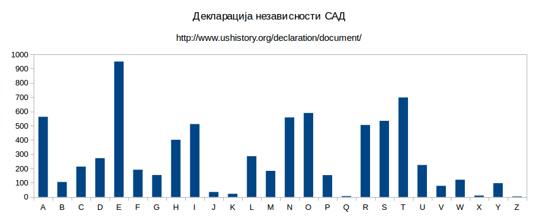

# Класична криптографија

**Класичне шифре (енгл. *Pen-and-paper ciphers*)**

- Шифре транспозиције (премештања)
- Шифре супституције (замене)
- *One-time pad*
- Кодне књиге

**Шифре транспозиције**

- Шифре премештања, енгл. *transposition ciphers*
- Међусобно се премештају (скремблују) слова отвореног текста
- Скрембловани текст је шифрат
	- Реч `bit` може да се скремблује на 3! = 6 начина
	- Порука дугачка 35 слова 35! = 1.0e40
- Кључ: начин премештања
- Одговара Шеноновом принципу дифузије

**Транспозиција колона**

- Скитала (енгл. *scytale*, користили је Спартанци)
- Одабере се матрица са жељеним бројем колона
	- Број редова зависи од дужине отвореног текста
	- Упише се отворени текст у редове матрице
- Шифрат се добија читањем колона
- нпр. матрица димензија 3 x 7
	- Отворени текст: `UNIVERZITETSINGIDUNUM`
	- Шифрат: `UIG NTI IED VTU ESN RIU ZNM`
- Кључ - број колона

<table>
	<tbody>
		<tr>
			<td>U</td>
			<td>N</td>
			<td>I</td>
			<td>V</td>
			<td>E</td>
			<td>R</td>
			<td>Z</td>
		</tr>
		<tr>
			<td>I</td>
			<td>T</td>
			<td>E</td>
			<td>T</td>
			<td>S</td>
			<td>I</td>
			<td>N</td>
		</tr>
		<tr>
			<td>G</td>
			<td>I</td>
			<td>D</td>
			<td>U</td>
			<td>N</td>
			<td>U</td>
			<td>M</td>
		</tr>
	</tbody>
</table>

**Транспозиција колона помоћу кључне речи**

- Унапређење транспозиције колона
- нпр. матрица димензија 3 x 7
	- Кључна реч `STUDENT` се тумачи по абецедном редоследу: 4-5-6-1-2-7-3
	- Отворени текст: `UNIVERZITETSINGIDUNUM`
	- Шифрат: `VTU ESN RIU UIG NTI ZNM IED`
- Даља побољшања: двострука транспозиција (пермутација редова и колона)
- Криптоанализа: нападач пронађе све могуће димензије матрице за задати шифрат а затим тражи смислену реч у првом реду да би погодио пермутацију колона

<table>
	<thead>
		<tr>
			<th>S</th>
			<th>T</th>
			<th>U</th>
			<th>D</th>
			<th>E</th>
			<th>N</th>
			<th>T</th>
		</tr>
	</thead>
	<tbody>
		<tr>
			<td>U</td>
			<td>N</td>
			<td>I</td>
			<td>V</td>
			<td>E</td>
			<td>R</td>
			<td>Z</td>
		</tr>
		<tr>
			<td>I</td>
			<td>T</td>
			<td>E</td>
			<td>T</td>
			<td>S</td>
			<td>I</td>
			<td>N</td>
		</tr>
		<tr>
			<td>G</td>
			<td>I</td>
			<td>D</td>
			<td>U</td>
			<td>N</td>
			<td>U</td>
			<td>M</td>
		</tr>
	</tbody>
</table>

**Шифре супституције**

- Шифре замене, енгл. *substitution ciphers*
- Једно слово (симбол) отвореног текста се мења са неким другим словом (симболом)
- Кључ: правило замене
	- Нека је кључ алфабетско пресликавање
	- Нападач мора да испроба 26! = 4.0e26 кључева
- Одговара Шеноновом принципу конфузије

**Цезарова шифра**

- Гај Јулије Цезар, енгл. *Caesar cipher*
- Шифрат се добија тако што се свако слово отвореног текста од A до W замени са словом које је за 3 места даље по абецедном реду, а слова X, Y и Z се замењују са A, B и C
- нпр. отворени текст: `UNIVERZITETSINGIDUNUM`
	- Шифрат: `XQLYHUCLWHWVLQJLGXQXP`
- Варијације: ROT-13 (померај за 13 места) и сл.
- Проблем: само 26 могућих кључева
	- Потребна је шифра замене која има велики простор кључева

**Општи облик шифре просте замене**

- Кључ не мора бити померај за одређени број као код Цезара и ROT-13, може бити било која пермутација од 26 слова (простор кључева 26!)
- Криптоанализа: статистика (статистичка структура енглеског језика) - мери се фреквенција појављивања појединих слова у шифрату; поређењем добијених фреквенција са статистичким (очекиваним) одређује се које слово је замењено са којим

**Хомофоне шифре**

- Хомофонија (у граматологији) - различити знакови за исту вредност
- Отворени текст је из скупа 26 слова, али шифрат садржи више од 26 знакова
- Већина слова из отвореног текста у шифрату се замењује једнозначно
- Нека слова отвореног текста могу да у шифрату буду представљена на више начина
	- Слова са најчешћом фреквенцијом ради нормализације статистике
- Додатни знакови служе за увођење елеманата случајности
- Криптоанализа: овакви системи су отпорнији на статистичке нападе, али су рањиви на нападе познатог дела отвореног текста

**Полиграмске шифре**

- Отворени текст се подели на блокове симбола и сваки блок се шифрује као једна целина
	- Блокови - би-грам, три-грам итд. (отуда назив "полиграмске")
- Представници:
	- Плејферова шифра (енгл. *Playfair  cipher*)
	- Хилова шифра (енгл. *Hill cipher*)

**Полиалфабетске шифре**

- Сличне шифрама просте замене, али постоји више алфабета који се користе за шифровање
- Представници:
	- Вижнерова шифра (енгл. *Vigenère cipher*)

**Вижнерова шифра**

- Блез де Вижнер, француски дипломата и криптограф (XVI век)
- Мулти-Цезарова шифра
- Кључ: `K = (k0, k1... km-1)
	- Скуп од m бројева чије су вредности између 0 и 25
- Шифровање:
	- 1\. слово отвореног текста: c0 = p0 + k0 (mod 26)
	- 2\. слово отвореног текста: c1 = p1 + k1 (mod 26)
	- ...
	- m. слово отвореног текста: cm-1 = pm-1 + km-1 (mod 26)
	- m + 1. слово отвореног текста: cm = pm + km0 (mod 26)
	- i. слово отвореног текста: ci = pi + ki mod m (mod 26)
- Дешифровање: pi = ci - ki mod m (mod 26)
- Важно својство: не може се разбити статистичком анализом на начин на који се примењује код шифара замене
	- Исто слово се шифрује другачије у зависности од места у отвореном тексту
- Остала неразбијена 300 година
- Криптоанализа: индекс коинциденције
