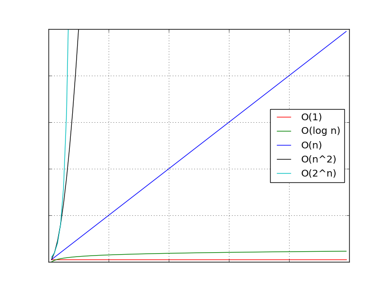

# Структуре података и алгоритми

**Решавање проблема на рачунару**

- Апстракција података (структуре података)
	- Раздвајање логичке слике података који се обрађују од њихове физичке реализације у рачунару
- Апстракција процедура (алгоритми)
	- Раздвајање функционалности процедура од њихове програмске реализације у рачунару

**Структура података**

- енгл. *data structure*
- Скуп података организованих на посебан начин
- Скуп операција дозвољен над скупом података
- Пример: низови, матрице...

**Алгоритам**

- енгл. *algorithm*
- Прецизан поступак којим се решава дати проблем
- Сви кораци поступка се могу механички извршити на рачунару
- Поступак је разумљив за људе, не за рачунаре
- Алгоритам != програм

**Алгоритамски проблеми**

- Улаз: инстанца проблема
- Алгоритамски кораци
- Излаз: решење инстанце

**Дизајн алгоритма**

- Писање низа наредби које сачињавају алгоритам за решење датог проблема

**Анализа алгоритма**

- Одређивање колико алгоритам заузима ресурсе рачунара (време, меморија...)

**Запис алгоритма**

- Компликованије идеје алгоритма треба изразити на што једноставнији начин
- Нотација примерена за људе, а не за машине
- Нагласак на логици решења, а не на програмској прецизности
- Псеудо језик: мешавина природног и програмских језика

**Алгоритми - временска сложеност**

- Емпиријско одређивање времена извршавања алгоритма
- Аналитичко одређивање времена извршавања алгоритма

**Емпиријско одређивање времена извршавања алгоритма**

- стгрч. *empeiria* - искуство
- Написати рачунарски програм према алгоритму
- Измерити његово време колико ради на рачунару
- Мана: ефикасност зависи од конкретног рачунара на коме се мери

**Аналитичко одређивање времена извршавања алгоритма**

- Пребројати укупан број основних корака (елементарних инструкција) који се извршавају у алгоритму
- Елементарне (основне) инструкције - наредбе чије је време извршавања константно, нпр.:
	- додела вредности променљивој
	- поређење вредности две променљиве
	- аритметичке операције
	- логичке операције
	- улазно/излазне операције
	- ...
- Елементарне операције се извршавају за једну јединицу времена

**Функција времена извршавања алгоритма**

- *n* - број улазних података (величина улаза)
- *T(n)* - функција времена извршавања
- Песимистички приступ: извршава се највећи могући број пута
- Узима се најгори могући случај извршавања
- Типичне функције времена извршавања:
	- T(n) = 1			- константна
	- T(n) = log n	- логаритамска
	- T(n) = n			- линеарна
	- T(n) = n^2		- квадратна
	- T(n) = 2^n		- експоненцијална

```
# T(n) = 1
i = 5

# T(n) = n
for i to n do
	print(i)

# T(n) = n * n = n^2
for i to n do
	for j to n do
		print(i)
```

**Асимптотска (Велико О) нотација**

- енгл. *Asymptotic/Big O notation*
- Доминантан терм је најважнији:
	- n^2 - n + 1 = O(n^2)
- Константни фактори нису важни:
	- 2 * n^2 = O(n^2)

**Типичне функције времена извршавања - поређење**



**Структура података**

- Колекција података организована на специјалан начин са скупом операција над њима
- Операције:
	- Прављење нове (празне) СП
	- Додавање једног елемента у СП
	- Уклањање једног елемента из СП
	- ...
- Основне СП:
	- Низови
	- Матрице
	- Листе
	- Стекови
	- Редови
	- Стабла

**Низови**

- енгл. *array*
- Елементи и индекси
- Матрица - дводимензионални низ

**Листе**

- енгл. *list*
- Сваки елемент листе осим последњег има тачно једног следбеника у низу
- Увек лак приступ: првом, последњем и актуелном елементу листе

**Стекови**

- енгл. *stack*
- LIFO - *last in, first out*
- Само је врх стека приступачан
- Аналогија: послужавници за храну

**Редови**

- енгл. *queue*
- FIFO - *first in, first out*
- Рад са редом је могућ само преко почетка и краја реда
- Аналогија: ред за чекање

**Стабла**

- енгл. *tree*
- Скуп чворова и скуп грана које повезују парове различитих чворова
- Грана је уређен пар чворова
- Први чвор у пару: родитељ (енгл. *parent*)
- Други чвор у пару: дете (енгл. *child*)
- Јединствен специјални чвор на врху: корен (енгл. *root*)
- Сваки чвор осим корена има јединствени родитељски чвор
- Унутрашњи чворови: имају бар једно дете
- Спољашњи чворови (листови, енгл. *leaf*): без деце
- Браћа (сестре): чворови-деца истог родитеља
- Дужина пута између два различита чвора: број грана на путу
- Висина стабла: дужина најкраћег јединственог пута од неког листа до корена
- Ниво стабла: чворови на истој дужини пута од корена
- Бинарна стабла: сваки унутрашњи чвор има највише двоје деце

**Напомена:** већина материјала преузета са курса "Структуре података и алгоритми" на [Универзитету Сингидунум](https://singidunum.ac.rs).
