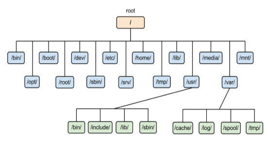

# Оперативни системи

**Напомена:** већина материјала преузета са истоименог курса на [Универзитету Сингидунум](https://singidunum.ac.rs).

# Увод у ОС

**Структура рачунарских система**

- Корисник
- Рачунар
	- Хардвер
		- Централни процесор
		- Меморија
		- Улазно-излазни уређаји
	- Оперативни систем
		- Језгро
		- Кориснички интерфејс
	- Кориснички софтвер
		- Апликације
		- Сервиси

**Покретање рачунара и оперативног система**

- BIOS/UEFI
- *Boot loader* - LILO, GRUB, NTLDR...
- Језгро ОС
- Подршка за уређаје (драјвери)
- Сервиси
- Кориснички интерфејс

**Језгро ОС (енгл. *kernel*)**

- Програм који се све време извршава на рачунару
- По строгој дефиницији: ОС = језгро
- Разликујемо:
	- Монолитно језгро
	- Микро-језгро
	- Хибридно језгро

**Кориснички интерфејс**

- Разликујемо:
	- Системи без корисничког интерфејса (енгл. *embedded*)
	- Конзолни (алфа-нумерички)
	- Графички
	- Веб
	- Комбиновани (нпр. гласовни улаз - графички излаз)

**Подела ОС по намени**

- ОС за корисничке рачунаре
- Серверски ОС
- ОС за мобилне уређаје
- Мрежни ОС
- ...

**ОС за корисничке рачунаре**

- DOS
- Microsoft Windows
- Linux: Debian, Fedora, openSUSE, Arch Linux, Gentoo, Slackware итд. за корисничке рачунаре и сервере, али и Андроид (за мобилне уређаје), OpenWrt (мрежни)...
- BSD: FreeBSD, NetBSD, OpenBSD
- Apple Mac OS X, iOS

## Управљање процесима

**Појам програма, процеса, нити и задатка**

- Програм
	- енгл. *program*
	- Скуп инструкција
	- Може бити и на спољној меморији (не извршава се)
- Задатак
	- енгл. *task*
	- Програм учитан у радну меморију
- Процес
	- енгл. *process*
	- Задатак чије је извршавање у току
	- Програмске инструкције + тренутно стање меморије
	- Засебан меморијски простор, ресурси
- Нит
	- енгл. *thread*
	- Линија (редослед) извршавања инструкција (корака) процеса
	- Нити деле исти меморијски простор

**Гранање процеса**

- Процес може покренути:
	- језгро ОС
	- корисник
	- други процес
- Дете процес
	- енгл. *child process*
	- Процес кога је покренуо неки други процес
- Родитељски процес
	- енгл. *parent process*
	- Процес који је покренуо неки други процес
- Зомби процес
	- енгл. *zombie process*
	- Термин са UNIX/Linux ОС
	- Користи се и термин *defunct* процес
	- Процес који је завршен али још увек постоји на листи
	- Алоцирани ресурси се не ослобађају
- Процес сироче
	- енгл. *orphan process*
	- Процес чији је родитељски процес завршен
	- Извршавање и крај процеса се предвиђају нормално

**Завршетак процеса**

- Процес се уклања из меморије након завршетка
- Неки процеси се не заврше регуларно
	- процеси зомбији
	- везивање у мртав чвор
	- случајне бесконачне петље
	- ...
- Такви процеси се могу оставити (!) или на силу уклонити
- Убијање процеса - насилно уклањање процеса из меморије
	- нпр. Линукс наредба `killall -9 firefox`

**Подела ОС по броју паралелних задатака и корисника**

- Једнокориснички, једнопрограмски - једноставно за инжењере, неефикасно за кориснике
- Једнокориснички, вишепрограмски
- Вишекориснички, једнопрограмски
- Вишекориснички, вишепрограмски

**Типови извршавања више задатака**

- Серијска обрада
	- енгл. *batch*
	- Рани рачунарски системи
- Дељење процесорског времена
	- Диспечер, распоређивач задатака (енгл. *task scheduler*)
	- Квази-паралелан рад
- Рад у реалном времену
	- Одзив у гарантованом временском интервалу
	- Контрола индустријских машина, медицинских уређаја...
	- Пожељна робустност

**Програм `top` за Линукс**


**Бесконачне петље**

- енгл. *infinite loop*
- Намерне:
	- системи са једном функцијом
	- пријем корисничког уноса
	- ОС
- Случајне:
	- грешке у програмирању
	- могу довести до блокаде система

```
while (true) {
	//
}
```

**Везивање процеса у мртав чвор**

- енгл. *deadlock*
- Ситуација у којој долази до цикличне зависности процеса или нити
- Резултат: процеси чији се извршавање никад неће завршити

**Процеси и привилегије**

- Рад на вишекорисничком систему
- Процес добија привилегије корисника који га покреће
- Корисник може затражити покретање под другим налогом
	- нпр. Линукс наредба `su`
- Безбедносни проблеми (покретање процеса са највишим привилегијама)
- Функционални проблеми (процес који опслужује више корисника, нпр. Апач веб-сервер)

**Међупроцесна комуникација**

- енгл. Inter-process communication, IPC
- Потреба да процеси међусобно размењују податке
- Различити приступи:
	- Фајл
	- Сигнал
	- Сокет
	- Пајп
	- Дељена меморија
	- Позивање удаљене процедуре (енгл. *Remote procedure call, RPC*)
	- ...

**Међупроцесна комуникација путем мреже**

- Најпопуларнија архитектура клијент-сервер
- Клијент и сервер су улоге процеса
	- Клијент је онај који тражи услугу
	- Процес је онај који пружа услугу
- Улоге се често приписују рачунарима
- Процес може играти обе улоге истовремено

**Апликације и сервиси**

- Апликације имају кориснички интерфејс
- Сервиси раде у позадини

## Управљање меморијом

**Типови меморије у рачунарима**

- Регистри
- Кеш-меморија
- Радна меморија
- Спољна меморија
	- SSD уређаји за складиштење
	- дискови - магнетни и оптички

**Регистри**

- Меморија на самом централном процесору
- Веома брза меморија
- Мали капацитет

**Кеш-меморија**

- Мањи капацитет од радне меморије
- Садржи копију последњих коришћених података из радне меморије
- Подела у више нивоа (L1, L2, L3)
	- нижи нивои: мањи капацитет, већа брзина
	- виши нивои: већи капацитет, мања брзина

**Радна меморија**

- енгл. *Random access memory, RAM*
- Примарна меморија рачунарског система
- Сви подаци се налазе у њој:
	- језгро ОС
	- инструкције програма који се извршавају
	- променљиве програма који се извршавају
- Савремени рачунари: 128 MB - 64 GB
- Потребно је имати довољно радне меморије:
	- мањак: успорење
	- вишак: нема негативних последица

**Управљање меморијом**

- Односи се на радну меморију
- Обухвата:
	- вођење стања меморије
	- додељивање меморије процесима (алоцирање)
	- ослобађање заузете меморије (деалоцирање)

**Додељивање меморије процесима**

- Инструкције програма се учитавају у меморију
- Програму се додељује и меморија за променљиве
- ОС води евиденцију ком процесу је додељен који сегмент

**Ослобађање меморије**

- Меморија која се не користи се ослобађа
	- уклањање променљивих
	- крај извршавања програма
- Садржај меморије се **не уклања**
- Ослобођени делови се означавају као слободни
- Садржај ослобођених делова се преписује новим
- Потенцијални безбедносни ризици

**Фрагментовање меморије**

- Меморија додељена процесу није у целини
- Разлози:
	- претходно покренути програми завршени
	- накнадна додела меморије
- Последица: пад перформанси
- Задатак за ОС, тј. део који управља меморијом
- Спољна и унутрашња фрагментација

**Виртуална меморија**

- Логичко проширење радне меморије
- Користи спољну меморију (хард-диск, SSD...)
- Тзв. *swap* партиција
- Далеко ниже перформансе
- Оно што се не користи тренутно ставља се у виртуалну меморију

**Директно приступање меморији**

- енгл. *Direct Memory Access, DMA*
- Улазно-излазни уређају приступају меморији директно
- Нема посредовања централног процесора
- Далеко више перформансе

## Фајл-систем

**Спољна меморија**

- Складиштење података који се тренутно не користе
- Различити типови:
	- SSD уређаји за складиштење
	- дискови - магнетни и оптички
- Начини за организацију података:
	- Системи за управљање базама података
	- Фајл-систем

**Системи за управљање базама података**

- енгл. *Database Management System, DBMS*
- Подршка апликацијама, посредан приступ
- Углавном текстуални подаци
- Ниже перформансе код одређених операција
- Често користи фајл-систем као основу
- Јединице података: базе, табеле, слогови (редови), поља
- Типови модела: хијерархијски, мрежни, релациони, објектни...

**Фајл-систем**

- енгл. *file system, FS*
- Јединице података: партиције, директоријуми, фајлови
- Хијерархијска организација података - стабло директоријума и фајлова

**Партиције**

- енгл. *partition*
- Део спољне меморије на којем се успоставља фајл-систем
- Типови: примарна (енгл. *primary*), проширена (енгл. *extended*)
- У MS Windows ОС се означавају словима: `C:`, `D:`, `E:` итд.
- У Линукс ОС се означавају адресом: `/dev/sda1`

**Директоријуми**

- енгл. *directory*
- Графичка репрезентација у виду фасцикле (енгл. *folder*)
- Користе се за организацију фајлова
- Партиције поседују по један корени директоријум
	- MS Windows - по један корени директоријум за сваку партицију
	- Линукс ОС - један корени директоријум

**Део стабла система фајлова на Линукс ОС**



**Путање**

- енгл. *path*
- Локација директоријума или фајла
- Апсолутна:
	- у односу на корен фајл-система
	- нпр. `/home/mmilanovic/Desktop/f.txt`
- Релативна:
	- у односу на тренутни (или неки други) директоријум
	- нпр. `../Desktop/f.txt` у односу на `/home/mmilanovic/Documents`

**Основне операције фајл-система**

- Креирање фајлова/директоријума
- Уписивање садржаја
- Ишчитавање садржаја
- Уклањање фајла

**Фрагментација код фајл-система**

- Унутрашња фрагментација
	- енгл. *internal fragmentation*
	- Неискоришћеност спољне меморије
	- Спољна меморија се дели у кластере
	- Заузима се цео кластер иако се не користи цео простор
- Спољашна фрагментација
	- енгл. *external fragmentation*
	- Успорење у раду као последица несуседности кластера фајла
	- Кластери једног фајла могу бити разбацани по диску

**Безбедност и поузданост фајл-система**

- Привилегије, контрола приступа
- Шифровање података
- Отпорност на грешке
- Могућност опоравка у случају хаварије

**Фајл-системи и компресовање података**

- Повећање капацитета спољне меморије
- Функција компресовања уграђена у функције фајл-система
- Нема потребе за додатним програмима
- Аутоматско функционисање у позадини
- Трговина на рачун процесорског времена (успорење)
- У одређеним ситуацијама перформансе на нивоу неупотребљивости

**Мрежни фајл-системи**

- Омогућавају приступ спољној меморији путем рачунарске мреже
- Реализују се на различитим нивоима
- Примери:
	- *Network File System, NFS*
	- *Common Internet File System / Server Message Block, CIFS/SMB*
	- *Google File System*

## Виртуализација

**Архитектура виртуалних машина**

- Хардвер рачунара
- Носећи ОС
- Софтвер за виртуализација
- Мрежа између виртуалних рачунара
	- Виртуална машина
	- ОС
	- Апликација
