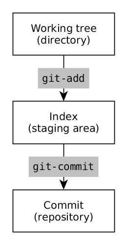

# Git 101



**Setup**

```
# Get and set global options [~/.gitconfig]
git config --global --list
git config --global user.name "Miloš Milanović"
git config --global user.email "milos.milanovic@example.com"
git config --global user.name
...
# Get and set repository options [./.git/config]
git config user.name "John Doe"
git config user.email "john.doe@example.com"
```

**Setup & init**

```
# Create an empty Git repository
git init
...
# Clone a repository into a new directory
git clone https://github.com/twbs/bootstrap.git
```

**Stage & snapshot**

```
# Show the working tree status
git status
...
# Add file contents to the index
git add f.txt
git add dir/
git add *.txt
git add .
...
# Reset current HEAD to the specified state
git add f.txt
git status
git reset f.txt
git status
...
# Record changes to the repository
git commit --all --message="First commit"
git commit -am "First commit"
...
# Show changes between commit and working tree
git diff
...
# Restore working tree files
rm f.txt
git checkout f.txt
```

**Tracking path changes**

```
# Remove files from the working tree and from the index
git rm f.txt
...
# Remove files from from the index
git rm --cached f.txt
...
# Move or rename a file or a directory
git mv f1.txt f2.txt
```

**Ignoring patterns**

```
# Preventing unintentional staging or commiting of files
touch .gitignore
echo "config.ini" >> .gitignore
echo "*.log" >> .gitignore
echo "docs/" >> .gitignore
```

**Inspect & compare**

```
# Show commit logs
git log
git log --max-count=5
git log -n 5
...
# Listing the history of a file
git log --follow f.txt
...
# Limit the commits output to ones with author header lines that match the specified pattern
git log --author="John"
...
# Show commits more recent than a specific date
git log --date=relative --since "2 hours ago" # alt.: --after
...
# Show commits older than a specific date
git log --date=short --until "2018-09-31" # alt.: --before
...
# Show changes between commits
COMMIT="29bd5e32186b2d56b7b35a09597bfed6636d66c9"
git diff $COMMIT f.txt
...
# Show any object in Git in human-readable format
git show $COMMIT
```

**Redo commits**

```
# Resets the index and working tree
COMMIT="29bd5e32186b2d56b7b35a09597bfed6636d66c9"
git reset --hard $COMMIT
```
