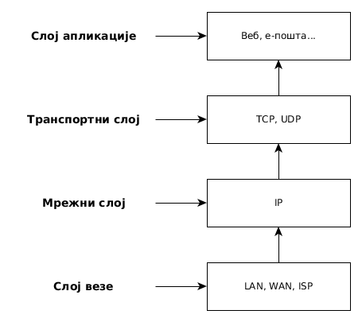

# Модели слојевите рачунарске комуникације

**OSI модел**

- енгл. *Open Systems Interconnection model*
- Стандардизован од стране Међународне организације за стандардизацију (енгл. *International Organization for Standardization, ISO*)
- Проблем: непотребно залажење у делове рачунарских система који нису директно задужени за међусистемску комуникацију
- Последица: јавио се велики број апликација које нису поштовале OSI стандард, а биле су у могућности да несметано комуницирају

\#   | Слој
:----|:-----------------------------------------------------
7    | Слој апликације (енгл. *Application layer*)
6    | Слој презентације (енгл. *Presentation layer*)
5    | Слој сесије (енгл. *Session layer*)
4    | Транспортни слој (енгл. *Transport layer*)
3    | Мрежни слој (енгл. *Network layer*)
2    | Слој везе (енгл. *Data link layer*)
1    | Физички слој (енгл. *Physical layer*)

**TCP/IP модел**

- Интернет модел
- *De facto* стандард

\#   | Слој               | Протоколи
:----|:-------------------|:---------------------------------------------------------------
4    | Слој апликације    | HTTP, DNS, DHCP, SSH, POP, IMAP, SMTP, IRC, SSH, FTP, NTP
3    | Транспортни слој   | TCP, UDP Портови
2    | Мрежни слој        | Логичке (IP) адресе
1    | Слој везе          | Физичке (MAC) адресе

