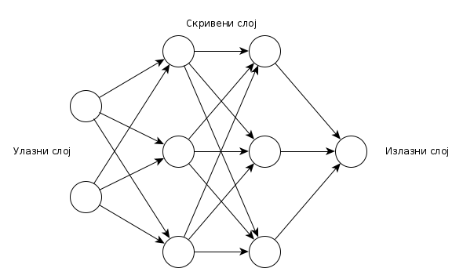
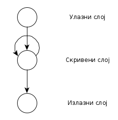

# Вештачке неуронске мреже

**Вештачке неуронске мреже**

- енгл. *Artificial Neural Networks, ANN*
- Претендују да симулирају начин рада људског мозга при обављању неке функције
- Инспирисане биолошким неуронским мрежама
- ВНМ "учи" да обавља неку функцију разматрајући примере обављања задате функције, није потребно да познаје алгоритам за ту функцију
- нпр. ВНМ може да "научи" да идентификује слике са мачком тако што ће анализирати слике које су означене са *cat* или *no cat* - није потребно да зна било шта друго о мачкама
- Конекционистички приступ ВИ

**Компоненте ВНН**

- Неурон
	- Улаз
	- Активација и праг
	- Излаз
- Синапсе
	- Везе између неурона
	- Један неурон може имати више улазних или излазних веза

**Слојеви ВНН**

- Улазни слој - слој који прима спољашње податке
- Излазни слој - слој који даје коначан резултат
- Између улазног и излазног слоја може бити 0 или више скривених слојева

**Подела ВНН по архитектури**

- ВНН са простирањем унапред
	- енгл. *Feed-forward ANN*
- Рекурентне ВНН
	- енгл. *Recurrent ANN*

**ВНН са простирањем унапред**

- Једносмеран проток података
- Сваки неурон из једног слоја је повезан са сваким неуроном из следећег слоја
- У примеру је приказана ВНН са простирањем унапред која има:
	- Улазни слој са 2 неурона
	- 2 скривена слоја са по 3 неурона
	- Излазни слој са једним неуроном
- Примена:
	- Препознавање образаца (енгл. *Pattern recognition*)

**Рекурентне ВНН**

- Двосмеран проток података
- Неурони могу имати везе и ка неуронима у претходном или истом слоју
	- Неурон може имати везу сам са собом
- Неурон може да меморише претходне улазе, што даје контекст улазним подацима
- Примена:
	- Обрада природних језика (енгл. *Natural Language Processing, NLP*)
	- Препознавање говора (енгл. *Speech recognition*)

